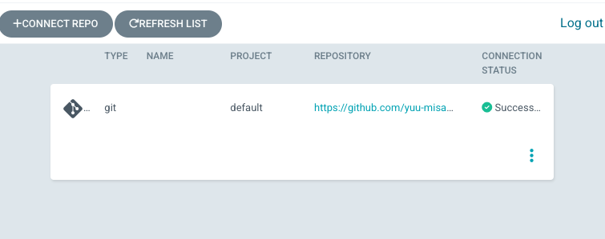

# eks-argocd-platform
eks-argocdでプラットフォームを管理するリポジトリ

# Requirement
  
* VSCode
* docker
* AWSアカウントと権限を持ったIAMユーザー

# Installation

- ローカルの~/.awsにアクセスキーなどの認証情報を設定する。<br>
https://docs.aws.amazon.com/ja_jp/cli/v1/userguide/cli-configure-files.html
- 当リポジトリをcloneまたはforkし、VSCodeで起動する。
- devcontainerを起動する。（dockerが起動している必要がある）
- tfstateを格納するためのS3を用意します。保存先がローカルで良ければ、backend.tfを書き換えて利用ください。
- SSL証明書を前提にしています。ドメインとともに発行して下さい。HTTPS接続が不要な場合は、ingress.yamlでHTTPSの設定を消せば動作するはずです。


# Usage
## terraform によるEKS clusterおよびネットワークの作成
- 必要な変数を以下ファイルに設定していきます。
    - manifest以下の<>内
    - terraform以下の<>内
- 以下コマンドでリソースを展開します。10分程度かかります。
```
tf-init
tf-apply
```

### argocdの展開

以下コマンドでargocdを展開します。
```
make argocd-init
```

port forwardでargocdとローカル環境を繋ぎます
```
make argocd-port-forward
```

portforwardを実行するターミナルを生かしながら、別ターミナルを開きます。<br>
以下コマンドでパスワードを取得し、portforwardしたlocalhost:ポート番号にブラウザなどからアクセスしてUIにげます。<br>
httpアクセスのため安全性を問われますが、詳細→localhostにアクセスするで接続できます。<br>
  
``` 
argocd admin initial-password -n argocd
```

argocd image updaterを以下コマンドで展開します
```
make argocd-image-updater
```


### appリポジトリを用意し、イメージをpushする
サンプルは以下。<br>
https://github.com/yuu-misaki/eks-argocd-app<br>
namespace, repository, imageのtagなど、共通させる必要があるので注意

### argocd applicationの展開
（連携先がpublish repositoryの場合はrepository連携を飛ばして良い）
githubでrepo権限があるtokenを発行する。
argocd uiで、Settings→Repositoriesでリポジトリを連携する
Via HTTPSを選択し、以下の通り埋める
- Type: git
- Project: default
- Repository URL: <連携したいrepository。.gitで終わるURL>
- Username: <githubユーザー名>
- Password: <github personel access>

CONNECTで繋がる


以下コマンドでリソースを展開する
```
make fastapi-init
kubectl apply -f manifest/fastapi/application.yaml
```
argocd ui上から展開されたアプリケーションを確認できる


